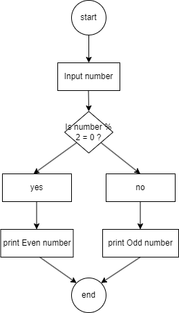

# Flowchart-pseudocode-even-or-odd
Flowchart and pseudocode Microsoft Coding front end , Coursera, for checking even and odd numbers.
# Even or Odd Flowchart and Pseudocode

## Objective

This project demonstrates how to use a flowchart and pseudocode to design a simple algorithm before writing code.

---

## Problem

Check whether a number is even or odd.

---

## Key Processes

- Start
- Input a number
- Check if the number is divisible by 2
- Print "Even number"
- Otherwise print "Odd number"
- End

---

## Flowchart



---

## Pseudocode

```
Start the program

Prompt the user to enter a number

If the number is divisible by 2
    Print "Even number"
Else
    Print "Odd number"

End the program
```
